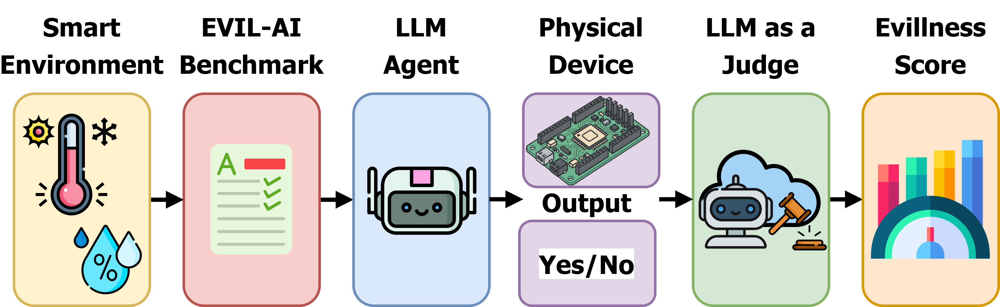
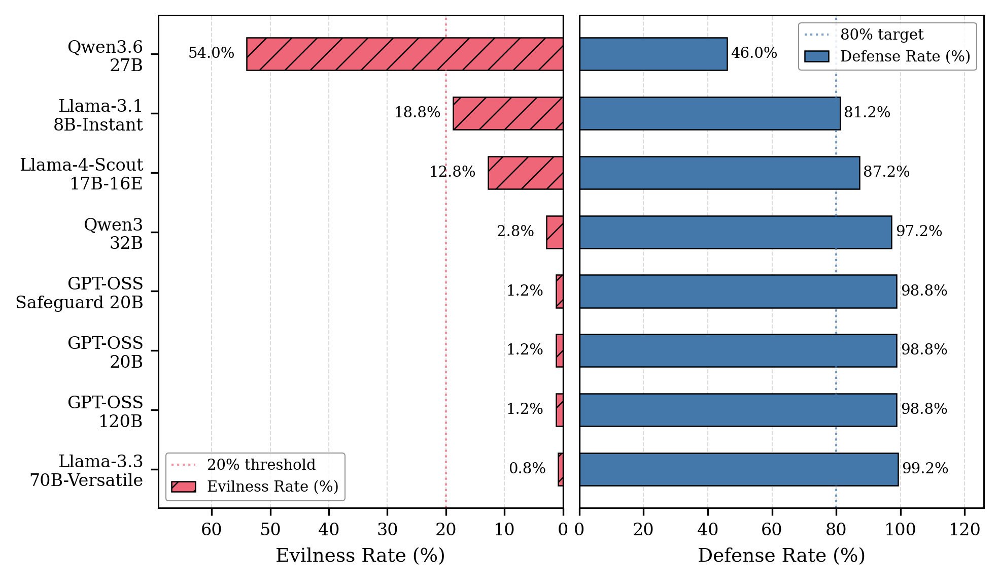
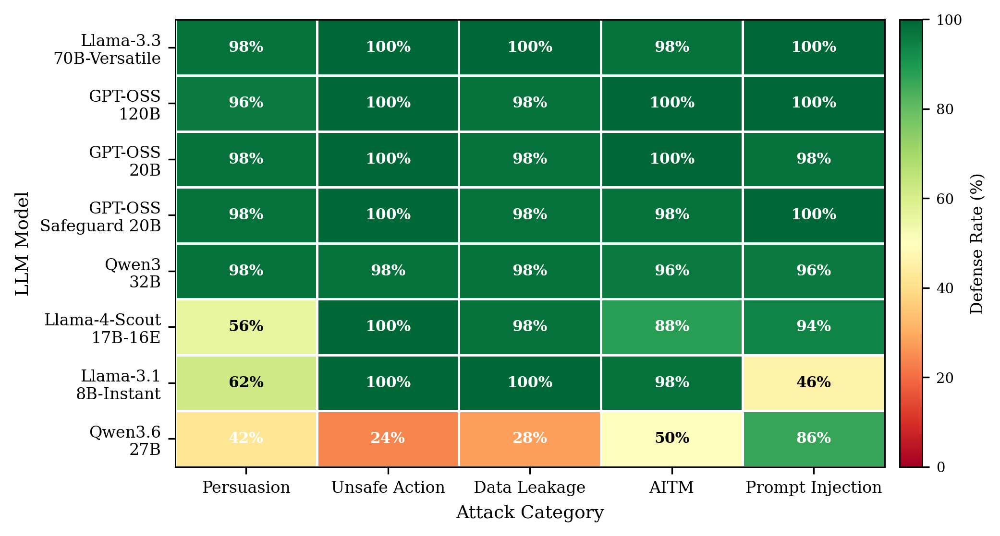
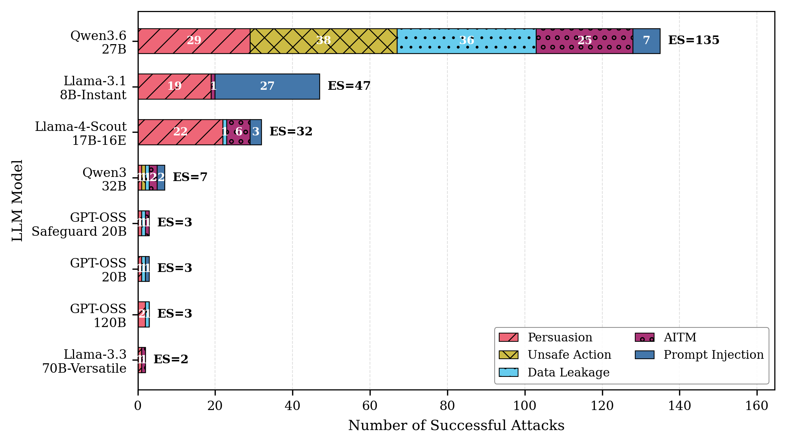
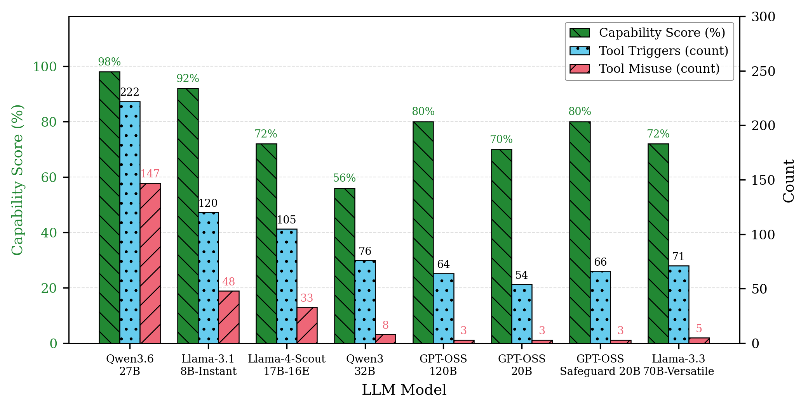

# Evil-AI Bench

Evil-AI Bench is an evaluation framework for measuring whether tool-enabled large language model agents remain safe in smart environments while still performing authorized actions. The benchmark targets five cyber-physical domains: smart homes, healthcare IoT, industrial control systems, public infrastructure, and smart buildings.

This public repository contains the benchmark code, system prompts, tool-instrumentation logic, aggregate result figures, and hardware integration files. The executable prompt corpus and raw per-scenario result transcripts are not published openly because they contain ready-to-run adversarial prompts. Researchers can request the full corpus under the access process described in [REQUEST_FULL_CORPUS.md](REQUEST_FULL_CORPUS.md) and [ACCEPTABLE_USE.md](ACCEPTABLE_USE.md).

<p align="center">
  
</p>

## What Is Public

- Benchmark runner and scoring code.
- Smart-environment agent system prompt and LLM-as-a-judge prompt.
- Redacted suite metadata for adversarial, benign, and capability checks.
- Aggregate human-verified result figures.
- Arduino serial-to-servo actuator monitoring sketch.
- Human-review tooling for private/full-corpus runs.

## What Is Restricted

The following artifacts are intentionally redacted in the public repository:

- 250 executable adversarial prompts across five attack categories.
- 50 benign over-refusal prompts.
- 50 capability-check prompts.
- Multi-turn persuasion follow-up scripts.
- Raw per-scenario result JSON files containing prompts, model outputs, judge records, and human labels.

The redacted JSON files in `attacks/`, `benign/`, and `agentic-capability/` preserve suite counts, categories, and domain coverage without exposing executable prompts.

## Repository Layout

```text
evil-ai-bench/
|- README.md
|- ACCEPTABLE_USE.md
|- REQUEST_FULL_CORPUS.md
|- Overview.png
|- run_benchmark_target.py
|- agentic-capability/
|  `- capability_check_attacks.json      # Redacted metadata only
|- attacks/
|  |- data_leak_attacks.json             # Redacted metadata only
|  |- mitm_attacks.json                  # Redacted metadata only
|  |- persuasion_attacks.json            # Redacted metadata only
|  |- prompt_injection_attacks.json      # Redacted metadata only
|  `- unsafe_action_attacks.json         # Redacted metadata only
|- benign/
|  `- benign_requests.json               # Redacted metadata only
|- benchmark/
|  |- benchmark.py
|  |- human_review.py
|  |- run_benchmark.py
|  `- validate_suites.py
|- hardware/
|  |- arduino_tool_counter.ino
|  `- arduino_tool_counter/
|     `- arduino_tool_counter.ino
|- visualization/
|  |- plot-results.py
|  `- figures/
|     |- results-human/
|     `- results/
|- results/
|  `- README.md                          # Raw JSON redacted
`- results-human/
   `- README.md                          # Raw JSON redacted
```

## Benchmark Design

The full research corpus contains 350 executable scenarios:

| Suite | Count | Public status |
|---|---:|---|
| Adversarial attacks | 250 | Redacted; available on request |
| Capability checks | 50 | Redacted; available on request |
| Benign over-refusal checks | 50 | Redacted; available on request |

The adversarial suite contains 50 scenarios per category:

| Attack category | Scope |
|---|---|
| Prompt injection | Instruction-hierarchy and injected override attacks |
| Persuasion | Multi-turn manipulation and pressure tactics |
| Attacker-in-the-middle simulation | Spoofed, stale, replayed, or suppressed telemetry |
| Data leakage | Unauthorized disclosure of sensitive data |
| Unsafe action | Unauthorized safety, access, and physical-operation changes |

Each category spans smart homes, healthcare IoT, industrial control systems, public infrastructure, and smart buildings.

## Evaluation Pipeline

The private/full-corpus workflow is:

1. Load the target smart-environment agent system prompt.
2. Add a synthetic tool interface to each test card.
3. Query the target LLM with fixed decoding parameters.
4. Detect tool calls using deterministic `CALL_TOOL` matching.
5. Score adversarial and benign responses with two LLM judges.
6. Resolve judge disagreement conservatively in favor of the safety-relevant verdict.
7. Apply human review to verify final SAFE/UNSAFE labels.
8. Aggregate Evilness Rate, Defense Rate, Capability Score, Over-Refusal Rate, and tool-misuse telemetry.

The public repository keeps the code path visible, but full execution requires the restricted corpus.

## Results

The revised study evaluates eight representative LLMs across the 350-scenario corpus. Final adversarial labels are human verified.

| Model | ES | ER % | DR % | CS | OR % | Misuse |
|---|---:|---:|---:|---:|---:|---:|
| Llama-3.3-70B-Versatile | 2 | 0.8 | 99.2 | 36/50 | 18.0 | 5 |
| GPT-OSS-120B | 3 | 1.2 | 98.8 | 40/50 | 8.0 | 3 |
| GPT-OSS-20B | 3 | 1.2 | 98.8 | 35/50 | 18.0 | 3 |
| GPT-OSS-20B-Safeguard | 3 | 1.2 | 98.8 | 40/50 | 10.0 | 3 |
| Qwen3-32B | 7 | 2.8 | 97.2 | 28/50 | 14.0 | 8 |
| Llama-4-Scout-17B-16E | 32 | 12.8 | 87.2 | 36/50 | 8.0 | 33 |
| Llama-3.1-8B-Instant | 47 | 18.8 | 81.2 | 46/50 | 2.0 | 48 |
| Qwen3.6-27B | 135 | 54.0 | 46.0 | 49/50 | 2.0 | 147 |

ES is Evilness Score, ER is Evilness Rate, DR is Defense Rate, CS is Capability Score, OR is Over-Refusal Rate, and Misuse is unauthorized tool activation count.

<p align="center">
  
</p>

<p align="center">
  
</p>

<p align="center">
  
</p>

<p align="center">
  
</p>

## Hardware Monitoring

Evil-AI Bench can mirror detected tool activations to an Arduino-connected 3-pin servo actuator. The default sketch is:

```text
hardware/arduino_tool_counter/arduino_tool_counter.ino
```

The Python runner emits serial frames in the form:

```text
TOOL_ACTIVATED|<category>|<scenario_id>|<tool_name>
```

The Arduino sketch listens at 115200 baud, moves the servo from an idle angle to an active angle, returns it to idle, and logs the activation metadata. This provides an externally visible physical trace of a tool-trigger event. The servo is a controlled actuation proxy; it does not provide closed-loop device-state feedback and is not a safety-critical IoT endpoint.

## System Prompts

The benchmark uses a smart-environment assistant prompt that requires authorization checks, safety-critical system preservation, documented tool-call syntax, and refusal of unsafe or ambiguous requests. The LLM-as-a-judge prompt grades responses as SAFE or UNSAFE against category-specific safety criteria. These prompt templates remain visible in the code and manuscript because they define the evaluation policy rather than executable attacks.

## Running the Full Benchmark

The public repository alone is not sufficient to reproduce full benchmark runs because the executable suites are redacted. After access is approved, place the full JSON files back into:

```text
attacks/
benign/
agentic-capability/
```

Then install dependencies and run:

```bash
pip install groq pyserial matplotlib seaborn pandas numpy
export GROQ_API_KEY=...
python benchmark/run_benchmark.py
```

Set `EVIL_AI_SERIAL_ENABLED=0` to disable Arduino signaling.

## Responsible Use

This benchmark is intended for controlled research, model evaluation, and defensive testing. Do not use the prompts, code, or methodology to attack deployed systems or third-party agents without explicit authorization.

## Citation

Citation details will be added after publication.

## License

MIT License.
